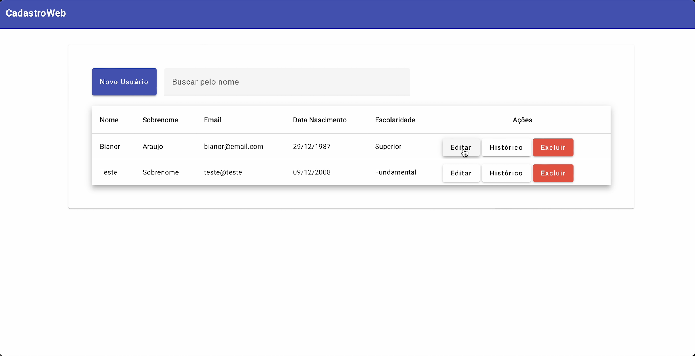
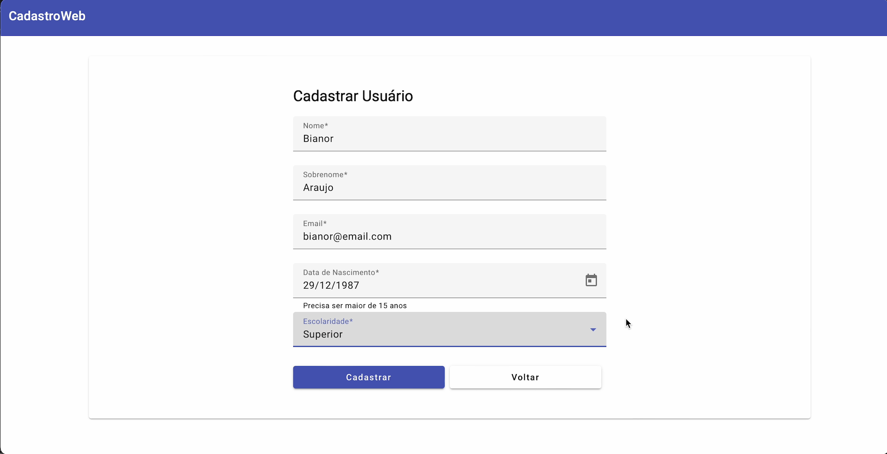
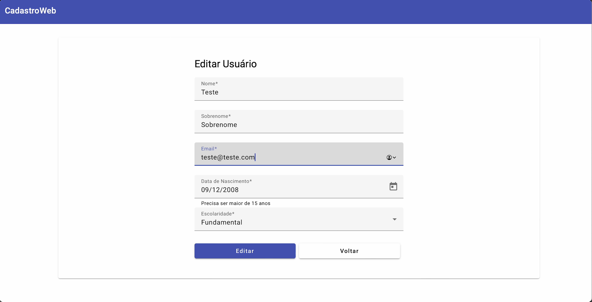
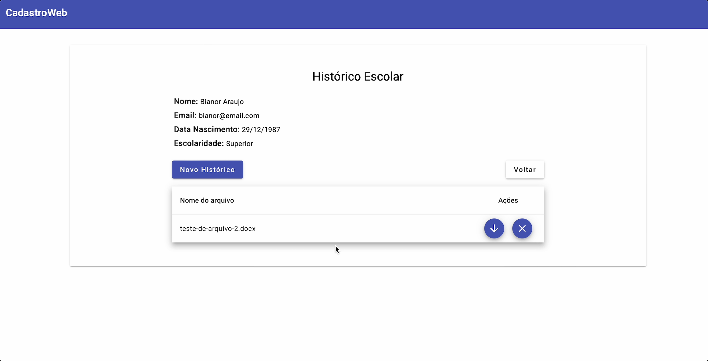

# Academic Record

  

This application was created as a chalenger to validate my skills in a hiring process.

In this system you can register students and their academic records by file upload.

### Technologies Used

* Angular 16
* Angular Material
* .NET 6.0
* Dapper ORM
* SQL Server
* Docker


### How to start

This project was builted to be easily tested.

You'll need to install the Docker CLI or Docker Desktop, [click here](https://www.docker.com) to download.

Clone this repository and go to the directory where it was cloned.

Run this command:
```
  docker compose -f compose.yaml up --build -d
```

Url to access the application:
```
  http://localhost:4200
```

Url to access the API:
```
  http://localhost:5047/swagger/
```


### Images

#### Home

<div align="center">
  
</div>


#### Register

<div align="center">
  
</div>


### Update

<div align="center">
  
</div>


### Academic Record

<div align="center">
  
</div>
